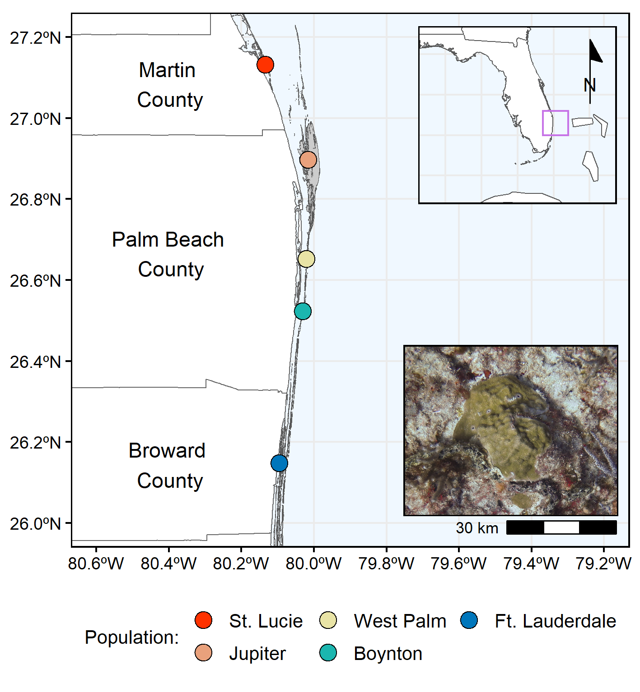
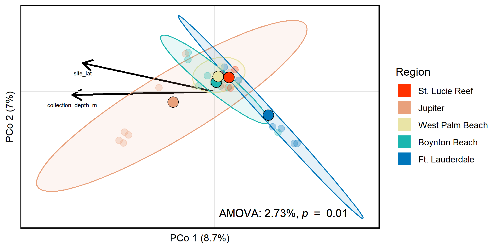
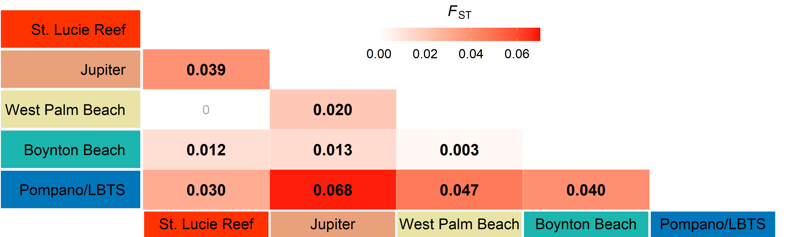
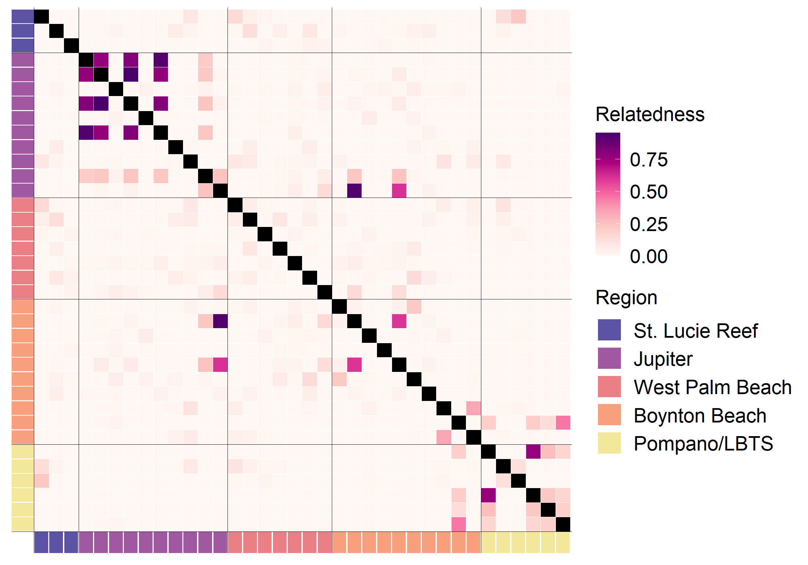

```{r setup, include=FALSE}
knitr::opts_chunk$set(echo = TRUE)
# setup rmarkdown environment first
knitr::opts_chunk$set(warning = FALSE, message = FALSE, fig.align = 'left')
```

# About this document
***
All analyses were performed in R version 4.1.1. This is the code that accompanies the publication (). Here you will find all the code to repeat the statistical analyses performed in R for the manuscript.

```{r, loading required packages & setup}
if (!require("pacman")) install.packages("pacman")

pacman::p_load_gh("pmartinezarbizu/pairwiseAdonis/pairwiseAdonis", "ropensci/rnaturalearthhires")
pacman::p_load("cowplot", "ggrepel", "ggspatial", "maps", "paletteer", "patchwork", "rgdal", "rnaturalearth", "sf", "tidyverse", "reshape2", "MCMC.OTU", "pairwiseAdonis", "RColorBrewer", "Redmonder", "flextable", "lubridate", "officer", "adegenet", "dendextend", "gdata", "ggdendro", "hierfstat", "Imap", "kableExtra", "poppr", "reshape2", "StAMPP", "vcfR", "vegan", "boa", "measurements", "magick", "rgeos")

```


## Map and shapefile data
Here we are setting up shape files and base maps as well as sample meta data.

```{r, map data}
pastSamples = read.csv("data_files/poritesastreoidesMetaData_clonesremoved.csv", header = TRUE) %>% select(sample = tube_id, !sample_id)

pastSamples$region = factor(pastSamples$region)
pastSamples$region = factor(pastSamples$region, levels = levels(pastSamples$region)[c(4, 2, 5, 1, 3)])
pastSamples$collection_date = mdy(pastSamples$collection_date) %>% format("%d %b %Y")
pastSamples$depthM = conv_unit(pastSamples$collection_depth_ft, from = "ft", to = "m") %>% round(1)

seflSites = pastSamples %>% group_by(region)%>% summarize(latDD = first(site_lat), longDD = first(site_long), depthRangeM = paste(min(depthM), "-", max(depthM), sep = ""), n = n(), date = as.character(min(collection_date))) %>% droplevels() %>% as.data.frame()

states = st_as_sf(ne_states(country = c("United States of America")))
countries = st_as_sf(ne_countries(country = c("Cuba", "The Bahamas")))
florida = read_sf("data_files/shp/flCountiesLo.shp") %>% st_transform(crs = 4326)
frt = read_sf("data_files/shp/flReefs.shp") %>% st_transform(crs = 4326)

countyNames = st_as_sf(maps::map("county", plot = FALSE, fill = TRUE)) %>% st_transform(crs = 4326) %>% filter(grepl("florida", ID)) %>% filter(grepl("palm beach|broward|martin", ID))
countyNames$ID = c("Broward \nCounty", "Martin \nCounty", "Palm Beach \nCounty")

popLabs = pastSamples %>% group_by(region)%>% summarize(latDD = first(site_lat), longDD = first(site_long))
levels(popLabs$region) = c("St. Lucie", "Jupiter", "West Palm", "Boynton", "Ft. Lauderdale")

```

<br>

## Florida polygon
Next we build a hi-res polygon of FL with the study site marked and a zoomed in map of the colony locations. We use `ggspatial` to add a north arrow and scale bar to the main map.
```{r, fl inset}
floridaMap = ggplot() +
  geom_sf(data = states, fill = "white", size = 0.25) +
  geom_sf(data = countries, fill = "white", size = 0.25) +
  geom_rect(aes(xmin = -80.6, xmax = -79.2, ymin = 26, ymax = 27.2), color = paletteer_d("vapoRwave::vapoRwave")[8], fill = NA) +
  coord_sf(xlim = c(-87, -77), ylim = c(23, 31)) +
  annotation_north_arrow(location = "tr", which_north = "true", style = north_arrow_minimal(), height = unit(1.2, "cm"), pad_x = unit(-0.25, "cm")) +
  theme_bw() +
  theme(panel.background = element_rect(fill = "aliceblue"),
        panel.border = element_rect(color = "black", size = 0.75, fill = NA),
        plot.background = element_blank(),
        axis.title = element_blank(),
        axis.ticks = element_blank(),
        axis.text = element_blank(),
        legend.position = "none")

floridaMap

```

<br>

## Final map of sites
Create a map of study sites with insets and legend
```{r, study map}
flPal = paletteer_d("rcartocolor::Sunset")[c(7, 6, 4, 3, 1)]

latLab = paste(format(abs(seq(26, 27.2, by = 0.2)), nsmall = 1), "ºN", sep = "")
longLab = paste(format(abs(seq(-80.6, -79.2, by = 0.2)), nsmall = 1), "ºW", sep = "")

siteMap = ggplot() +
  geom_sf(data = florida, fill = "white", color = "gray40", size = 0.25) +
  geom_sf(data = countries, fill = "white", color = "gray40", size = 0.25) +
  geom_sf(data = frt, fill = "gray80", size = 0) +
  geom_point(data = popLabs, aes(x = longDD, y = latDD, fill = region), shape = 21, size = 2) +
  geom_sf_text(data = countyNames, aes(label = ID), nudge_x = c(0.1, 0, 0.1),
               nudge_y = c(0, -.025, -0.1)) +
  scale_fill_manual(values = flPal, name = "Population:") +
  coord_sf(xlim = c(-80.6, -79.2), ylim = c(26, 27.2)) +
  scale_x_continuous(breaks = c(seq(-80.6, -79.2, by = 0.2)), labels = longLab) +
  scale_y_continuous(breaks = c(seq(26, 27.2, by = 0.2)), labels = latLab) +
  annotation_scale(location = "br") +
  guides(fill = guide_legend(ncol = 3)) +
  theme_bw() +
  theme(panel.background = element_rect(fill = "aliceblue"),
        panel.border = element_rect(color = "black", size = 0.75, fill = NA),
        plot.background = element_blank(),
        axis.ticks = element_line(color = "black"),
        axis.text = element_text(color = "black"),
        axis.title = element_blank(),
        legend.background = element_blank(),
        legend.title = element_text(size = 10),
        legend.text = element_text(size = 8),
        legend.key = element_blank(),
        legend.position = "bottom",
        legend.direction = "horizontal")

#add a picture of P. astreoides
pastPic = image_read("data_files/past.png") %>%
  image_border("black", "10x10")

seflMap = ggdraw() +
  draw_plot(siteMap) +
  draw_plot(floridaMap, x = 0.63, y = 0.655, width = 0.35, height = 0.35) +
  draw_image(pastPic, x = 0.63, y = 0.21, width = 0.336, height = 0.336)

# seflMap

ggsave("figures/pastMap.png", plot = seflMap, width = 12, height = 13, units = "cm", dpi = 300)
ggsave("figures/pastMap.tiff", plot = seflMap, width = 12, height = 13, units = "cm", dpi = 300)
ggsave("figures/pastMap.eps", plot = seflMap, width = 12, height = 13, units = "cm", dpi = 300)

```



<br>

```{r, Analysis of Molecular Variance}
#reading in bcf file
pastVcf = read.vcfR("data_files/pastNoClones.bcf", verbose = TRUE)
#convert to genlight files for poppr
pastGenlightPopulation = vcfR2genlight(pastVcf, n.cores = 1)

#taking metadata file, without technical replicates & clones, reads in population data for each sample
popData = read.csv("data_files/poritesastreoidesMetaData_clonesremoved.csv") %>% select("sample" = tube_id, "pop" = region)

#setting up amova
strata(pastGenlightPopulation) = data.frame(popData)
setPop(pastGenlightPopulation) = ~pop
#Runs AMOVA looking at samples by region
amova <- poppr.amova(pastGenlightPopulation, ~pop)
amova

set.seed(694)
amovasignif <- randtest(amova, nrepet = 99)
amovasignif$names

amovasignif$obs

amovasignif$pvalue

amovaPerc = paste(round(amova$componentsofcovariance$`%`[1], 2), "%",sep="")
amovaP = amovasignif$pvalue[3]

```
Only significant differences between populations, explains 2.73% of variation

```{r, PCoA with IBS}
pastMa = as.matrix(read.table("data_files/pastNoClones.ibsMat"))
pastMds = cmdscale(pastMa, eig = TRUE, x.ret = TRUE)

# Determine percent variation captured on each axis
# Calculate the eigenvalues so later we can figure out % variation shown on each Principal Coordinate
pastPcoaVar = round(pastMds$eig/sum(pastMds$eig)*100, 1)
head(pastPcoaVar)
# Format data to plot
pastPcoaValues = pastMds$points
head(pastPcoaValues)
 # 2-column tab-delimited table of individual assignments to populations; must be in the same order as samples in the bam list or vcf file.
pastI2P = read.csv("data_files/poritesastreoidesMetaData_clonesremoved.csv") %>% select("sample" = tube_id, "pop" = region)

row.names(pastI2P) = pastI2P[,1]
pastPcoaValues=cbind(pastI2P, pastPcoaValues)
pastPcoaValues =as.data.frame(pastPcoaValues, sample = rownames(pastPcoaValues))
colnames(pastPcoaValues)[c(3,4)] = c("PCo1", "PCo2")
head(pastPcoaValues)

pastPCoA = merge(pastPcoaValues, aggregate(cbind(mean.x=PCo1,mean.y=PCo2)~pop, pastPcoaValues, mean), by="pop")

pastPCoA$pop = factor(pastPCoA$pop)
pastPCoA$pop = factor(pastPCoA$pop, levels(pastPCoA$pop)[c(4, 2, 5, 1, 3)])

pastPcoaPlotA = ggplot(pastPCoA, aes(x = PCo1, y = PCo2, color = pop, fill = pop)) +
  geom_hline(yintercept = 0, color = "gray90", size = 0.5) +
  geom_vline(xintercept = 0, color = "gray90", size = 0.5) +
  #ellipses
  stat_ellipse(data = pastPCoA, type = "t", geom = "polygon", alpha = 0.1) +
  #individual's indicated by small transparent circles
  geom_point(aes(x = PCo1, y = PCo2), size = 3, alpha = 0.3, show.legend = FALSE) +
  #population centroids indicated by large circles
  geom_point(aes(x = mean.x, y = mean.y), size = 5, color = "black", shape = 21) +
   annotate(geom = "text", x = 0.1, y = -0.25, label = bquote("AMOVA:"~.(amovaPerc)*","~italic(p)~" = "~.(amovaP))) +
  scale_fill_manual(values = flPal, name = "Region") +
  scale_color_manual(values = flPal, guide = NULL) +
  xlab(paste ("PCo 1 (", pastPcoaVar[1],"%)", sep = "")) + #Prints percent variation explained by first axis
  ylab(paste ("PCo 2 (", pastPcoaVar[2],"%)", sep = "")) + #Prints percent variation explained by second axis
  guides(shape = guide_legend(order = 2), linetype = guide_legend(override.aes = list(linetype = c(1,2), alpha = 1, color = "black", fill = NA), order = 3), fill = guide_legend(override.aes = list(shape = 22, size = 5, color = NA, alpha = NA), order = 1))+
  theme_bw()

pastPcoaPlot = pastPcoaPlotA +
  theme(axis.title.x = element_text(color = "black", size = 10),
        axis.text.x = element_blank(),
        axis.ticks.x = element_blank(),
        axis.line.x = element_blank(),
        axis.title.y = element_text(color = "black", size = 10),
        axis.text.y = element_blank(),
        axis.ticks.y = element_blank(),
        axis.line.y = element_blank(),
        legend.position = "right",
        panel.border = element_rect(color = "black", size = 1),
        panel.background = element_rect(fill = "white"),
        panel.grid.major = element_blank(),
        panel.grid.minor = element_blank())

# pastPcoaPlot

ggsave("figures/pcoaPlot.png", plot = pastPcoaPlot, height = 3.5, width = 7, units = "in", dpi = 300)
ggsave("figures/pcoaPlot.pdf", plot = pastPcoaPlot, height = 3.5, width = 7, units = "in", dpi = 300)
ggsave("figures/pcoaPlot.tiff", plot = pastPcoaPlot, height = 3.5, width = 7, units = "in", dpi = 300)

```

<br>

```{r, Pairwise Fst}
pastVcf = read.vcfR("data_files/pastNoClones.bcf", verbose = FALSE)
pastGenlightPopulation = vcfR2genlight(pastVcf, n.cores = 1)
locNames(pastGenlightPopulation) = paste(pastVcf@fix[,1],pastVcf@fix[,2],sep="_")

popData = read.csv("data_files/poritesastreoidesMetaData_clonesremoved.csv") %>% select("sample" = tube_id, "pop" = region)

strata(pastGenlightPopulation) = data.frame(popData)
setPop(pastGenlightPopulation) = ~pop

pastGenlightPopulation$pop = factor(pastGenlightPopulation$pop)
pastGenlightPopulation$pop = factor(pastGenlightPopulation$pop,
                                levels(pastGenlightPopulation$pop)[c(4, 1, 2, 3, 5)])

set.seed(694)

#99 permutations
sefl.fst <- stamppFst(pastGenlightPopulation, nboots = 99, percent = 95, nclusters = 2)
sefl.fst$Fsts

sefl.fst$Pvalues

#reordering my samples to stay formatted properly for the matrix, and still have them go north to south
pop.order = c("Pompano/LBTS", "Boynton Beach", "West Palm Beach", "Jupiter", "St. Lucie Reef")

#reads in Fst matrix
snpFstMa <- as.matrix(sefl.fst$Fsts)
#rebuilding the matrix based on order of populations
upperTriangle(snpFstMa, byrow = TRUE) <- lowerTriangle(snpFstMa)
snpFstMa <- snpFstMa[,pop.order] %>% .[pop.order,]
snpFstMa[upper.tri(snpFstMa)] <- NA
snpFstMa <- as.data.frame(snpFstMa)

snpFstMa$Pop = factor(row.names(snpFstMa))

snpQMa <- as.matrix(sefl.fst$Pvalues)
upperTriangle(snpQMa, byrow=TRUE) <- lowerTriangle(snpQMa)
snpQMa <- snpQMa[,pop.order] %>%
  .[pop.order,]
snpQMa[upper.tri(snpQMa)] <- NA
snpQMa <- as.data.frame(snpQMa)
snpQMa$Pop = factor(row.names(snpQMa), levels = unique(pop.order))

snpFstMa$Pop = factor(row.names(snpFstMa), levels = unique(pop.order))
snpFst = melt(snpFstMa, id.vars = "Pop", value.name = "Fst", variable.name = "Pop2", na.rm = FALSE)
snpFst$Fst = round(snpFst$Fst, 3)
snpFst = snpFst %>% mutate(Fst = replace(Fst, Fst < 0, 0))

snpQ = melt(snpQMa, id.vars = "Pop", value.name = "Pval", variable.name = "Pop2", na.rm = FALSE)
snpQ$Qval = p.adjust(snpQ$Pval, method = "BH")

snpFst$region = snpFst$Pop
snpFst$region = factor(gsub("\\n.*", "", snpFst$region))
snpFst$region = factor(snpFst$region, levels = levels(snpFst$region)[c(4, 2, 5, 1, 3)])

snpFst$region2 = snpFst$Pop2
snpFst$region2 = factor(gsub("\\n.*", "", snpFst$region2))
snpFst$region2 = factor(snpFst$region2, levels = levels(snpFst$region2)[c(4, 2, 5, 1, 3)])

snpFst$Fst = sprintf('%.3f', snpFst$Fst)
snpFst$Fst = factor(gsub("\\NA", NA, snpFst$Fst))
snpFst$Fst = factor(gsub("\\.000", "", snpFst$Fst))
snpFst$Fst = factor(gsub("\\-", "", snpFst$Fst))

snpHeatmapA = ggplot(data = snpFst, aes(Pop, Pop2, fill = as.numeric(as.character(Fst))))+
  geom_tile(color = "white") +
  
### mess with next 4 lines to fix sizes of boxes that region names are in
  geom_segment(data = snpFst, aes(x = 0.48, xend = -0.62, y = Pop, yend = Pop, color = region), size = 19) +
  geom_segment(data = snpFst, aes(x = Pop2, xend = Pop2, y = 0.45, yend = -0.6, color = region2), size = 62.5) +
  scale_color_manual(values = flPal[], guide = NULL) +
  scale_fill_gradient(low = "white", high = "red", limit = c(0, 0.07), space = "Lab", name = expression(paste(italic("F")[ST])), na.value = "white",  guide = "colourbar")+
  geom_text(data = snpFst, aes(Pop, Pop2, label = Fst), color = ifelse(snpQ$Qval <= 0.05,"black", "darkgrey"), size = ifelse(snpQ$Qval < 0.05, 6, 5), fontface = ifelse (snpQ$Qval < 0.05, "bold", "plain")) +
  guides(fill = guide_colorbar(barwidth = 12, barheight = 1, title.position = "top", title.hjust = 0.5)) +
  scale_y_discrete(position = "left") +
  scale_x_discrete(limits = rev(levels(snpFst$Pop))[c(1:5)]) +
  coord_cartesian(xlim = c(1, 5), ylim = c(1, 5), clip = "off") +
  theme_minimal()

snpHeatmap = snpHeatmapA + theme(
  axis.text.x = element_text(vjust = 1, size = 16, hjust = 0.5, color = "black"),
  axis.text.y = element_text(size = 16, color = "black"),
  axis.title.x = element_blank(),
  axis.title.y = element_blank(),
  panel.grid.major = element_blank(),
  panel.border = element_blank(),
  axis.ticks = element_blank(),
  legend.position = c(0.5, 0.87),
  legend.direction = "horizontal",
  legend.title = element_text(size = 16),
  legend.text = element_text(size = 14),
  plot.title = element_text(size = 16)
)

# snpHeatmap

ggsave("figures/fstHeatMap.png", plot = snpHeatmap, width = 30, height = 9, units = "cm", dpi = 300)
ggsave("figures/fstHeatMap.eps", plot = snpHeatmap, width = 30, height = 9, units = "cm", dpi = 300)
```

<br>

## Heterozygosity & Inbreeding
```{r, popStats}
popData = read.csv("data_files/poritesastreoidesMetaData_clonesremoved.csv") %>% select("sample" = tube_id, "Region" = region) # Reads in population data

popData$a = c(0:35)
popData$Region = factor(popData$Region)
popData$Region = factor(popData$Region, levels = levels(popData$Region)[c(4, 2, 5, 1, 3)])
hetAll = read.table("data_files/hetAllSites")

colnames(hetAll) = c("sample", "All")
hetAll$sample = popData$sample

HetSNPs = read.table("data_files/HetSNPs")
colnames(HetSNPs) = c("sample", "SNPs")
HetSNPs$sample = popData$sample

pastBreed = read.delim("data_files/newres")
pastBreed2 = pastBreed %>% group_by(a) %>% select("inbreed" = Fa)
pastBreed3 = pastBreed %>% group_by(b) %>% select("inbreed" = Fb)
pastBreed = bind_rows(pastBreed2, pastBreed3) %>% group_by(a) %>% summarize("inbreed" = mean(inbreed))

pastRelate = read.delim("data_files/newres")
pastRelate2 = pastRelate %>% group_by(a, b) %>% select("relate" = rab)
pastRelate2 = pastRelate2 %>% left_join(popData, by = "a") %>% left_join(popData, by = c("b" = "a"), suffix = c(".a", ".b")) 
# pastRelate2$popDepth.a = paste(pastRelate2$Region.a, pastRelate2$Depth.a, sep = " ")
# pastRelate2$popDepth.b = paste(pastRelate2$Region.b, pastRelate2$Depth.b, sep = " ")
pastRelate = pastRelate2 %>% filter(Region.a == Region.b) %>% rename(Region = Region.a)
het = left_join(popData, hetAll, by = "sample") %>% left_join(HetSNPs, by = "sample") %>% mutate("inbreed" = pastBreed$inbreed)
hetStats = het %>% group_by(Region) %>% dplyr::summarise(N = n(), meanAll = mean(All), sdAll = sd(All), seAll = sd(All)/sqrt(N), meanSnps = mean(SNPs), sdSnps = sd(SNPs), seSnps = sd(SNPs)/sqrt(N), meanInbreed = mean(inbreed), sdInbreed = sd(inbreed), seInbreed = sd(inbreed)/sqrt(N))
min(hetStats$meanAll, na.rm = TRUE)
max(hetStats$meanAll, na.rm = TRUE)
min(hetStats$meanSnps, na.rm = TRUE)
max(hetStats$meanSnps, na.rm = TRUE)
hetAllLm = lm(data = het, All~Region)
hetSnpLm = lm(data = het, SNPs~Region)
inbreedLm = lm(data = het, inbreed~Region)
relateLm = lm(data = pastRelate, relate~Region)
hetAllANOVA = summary(aov(hetAllLm))
hetAllANOVA
hetSnpANOVA = summary(aov(hetSnpLm))
hetSnpANOVA
inbreedANOVA = summary(aov(inbreedLm))
inbreedANOVA
relateANOVA = summary(aov(relateLm))
relateANOVA
hetTab = hetStats

##may want to format this table for manuscript if it's interesting
```

```{r, Individual relatedness heatmap}
pastFam = pastRelate2
pastFam$Region.a = factor(pastFam$Region.a)
pastFam$Region.b = factor(pastFam$Region.b)
#make sure regions are ordered North-->South
levels(pastFam$Region.a)
#if not, reorder
#pastFam$Region.a = factor(pastFam$Region.a, levels = levels(pastFam$Region.a)[c()])
#pastFam$Region.b = factor(pastFam$Region.b, levels = levels(pastFam$Region.b)[c()])
pastMatDat = pastFam %>% as.data.frame () %>% select(sample.a, sample.b, relate)
nameVals <- sort(unique(unlist(pastMatDat[1:2])))

# construct 0 matrix of correct dimensions with row and column names
pastMat <- matrix(0, length(nameVals), length(nameVals), dimnames = list(nameVals, nameVals))

# fill in the matrix with matrix indexing on row and column names
pastMat[as.matrix(pastMatDat[c("sample.a", "sample.b")])] <- pastMatDat[["relate"]]
lowerTriangle(pastMat, byrow = TRUE) <- upperTriangle(pastMat)
pastFam = pastFam %>% arrange(Region.a)
pastFam$sample.a = factor(pastFam$sample.a)
pastFam$sample.a = factor(pastFam$sample.a, levels = unique(pastFam$sample.a))
#replacing the last sample name which was just NA
pastFam$sample.a = factor(pastFam$sample.a, levels = c(levels(pastFam$sample.a),"P087"))
pastFam$sample.b = factor(pastFam$sample.b)
pastFam$sample.b = factor(pastFam$sample.b, levels = levels(pastFam$sample.a))
sampleOrder = levels(pastFam$sample.a)

pastMat <- pastMat[,sampleOrder] %>%
  .[sampleOrder,]
diag(pastMat)<-NA
pastMat <- as.data.frame(pastMat)
pastMat$sample.a = factor(colnames(pastMat))
popData = read.csv("data_files/poritesastreoidesMetaData_clonesremoved.csv") %>% select("sample.a" = tube_id, "region" = region)
pastMat = pastMat %>% left_join(popData)
pastMat$sample.a = factor(pastMat$sample.a, levels = unique(sampleOrder))
pastFam = melt(pastMat, id.vars = c("sample.a", "region"), value.name = "relate", variable.name = "sample.b", na.rm = FALSE)
pastFam$region = factor(pastFam$region)
pastFam$region = factor(pastFam$region, levels = levels(pastFam$region)[c(4, 2, 5, 1, 3)])

relateHeatmapA = ggplot(data = pastFam, aes(sample.a, sample.b, fill = relate)) +
  geom_tile(color = "white")+
  geom_segment(data = pastFam, aes(x = sample.a, xend = sample.a, y = .5, yend = -1, color = region), size = 4.5) +
  geom_segment(data = pastFam, aes(x = .5, xend = -1, y = sample.a, yend = sample.a, color = region), size = 4.5) +
  scale_color_manual(values = flPal, guide = NULL, name = "Region") + 
  geom_vline(xintercept = c(0.5,3.5, 13.5, 20.5, 30.5), size = 0.1, color = "black") +
  geom_hline(yintercept = c(0.5,6.5, 16.5, 23.5, 33.5), size = 0.1, color = "black") +
  scale_fill_gradientn(colors = paletteer_d("RColorBrewer::RdPu"), space = "Lab", name = "Relatedness", na.value = "black", guide = guide_colorbar(order = 1)) +
  guides(color = guide_legend(override.aes = list(size = 7), order = 2), fill = guide_colorbar(order = 1)) +
  scale_y_discrete(limits = rev(levels(pastFam$sample.b))) +
  theme_minimal()

relateHeatmap = relateHeatmapA + theme(
  axis.text.x = element_blank(),
  axis.text.y = element_blank(),
  axis.title.x = element_blank(),
  axis.title.y = element_blank(),
  panel.grid.major = element_blank(),
  panel.border = element_blank(),
  panel.background = element_blank(),
  axis.ticks = element_blank(),
  legend.title = element_text(size = 14),
  legend.text = element_text(size = 14),
  plot.title = element_text(size = 16)
)

# relateHeatmap

ggsave("figures/relateHeatmap.png", plot = relateHeatmap, width = 20, height = 14, units = "cm", dpi = 300)

```
#


```{r, plots for heterozygosity and inbreeding}
hetMelt = melt(het, id.vars = c("sample", "Region"), variable.name = "type", value.name = "heterozygosity")

hetTheme = theme(axis.title.x = element_text(color = "black", size = 12),
        axis.text.x = element_blank(),
        axis.ticks.x = element_blank(),
        axis.title.y = element_text(color = "black", size = 12),
        axis.text.y = element_text(color = "black", size = 10),
        axis.ticks.y = element_line(color = "black"),
        legend.position = "right",
        legend.key.size = unit(0.5, 'cm'),
        panel.border = element_rect(color = "black"),
        panel.background = element_rect(fill = "white"),
        plot.background = element_rect(fill = "white"),
        panel.grid.major = element_blank(),
        panel.grid.minor = element_blank())

dodge <- position_dodge(width = 1)

hetPlotAll = ggplot(data = subset(hetMelt, subset = hetMelt$type == "All"),aes(x = Region, y = heterozygosity, fill = Region)) +
  geom_point(aes(color = Region),shape = 21, position = position_jitterdodge(seed = 1, dodge.width = 1), size = 2, alpha = 0.7) +
  # geom_violin(size = 0.5, alpha = 0.7, position = dodge, color = "gray35") +
  geom_boxplot(size = 0.5, alpha = 0.7, position = dodge, color = "gray35", outlier.shape = NA) +
  xlab("Region") +
  ylab("Heterozygosity") +
  ggtitle("All loci") +
  scale_fill_manual(values = flPal) +  
  scale_color_manual(values = flPal) +
  theme_bw() +
  hetTheme
  
hetPlotSnps = ggplot(data = subset(hetMelt, subset = hetMelt$type == "SNPs"),aes(x = Region, y = heterozygosity, fill = Region)) +
  geom_point(aes(color = Region),shape = 21, position = position_jitterdodge(seed = 1, dodge.width = 1), size = 2, alpha = 0.7) +
  # geom_violin(size = 0.5, alpha = 0.7, position = dodge, color = "gray35") +
  geom_boxplot(size = 0.5, alpha = 0.7, position = dodge, color = "gray35", outlier.shape = NA) +
  xlab("Region") +
  ylab("Heterozygosity") +
  ggtitle("SNPs") +
  scale_fill_manual(values = flPal) +
  scale_color_manual(values = flPal) +
  theme_bw() +
  hetTheme

inbreedingPlot = ggplot(data = het, aes(x = Region, y = inbreed, fill = Region)) +
  geom_point(aes(color = Region),shape = 21, position = position_jitterdodge(seed = 1, dodge.width = 1), size = 2, alpha = 0.7) +
  # geom_violin(size = 0.5, alpha = 0.7, position = dodge, color = "gray35") +
  geom_boxplot(size = 0.5, alpha = 0.7, position = dodge, color = "gray35", outlier.shape = NA) +
  xlab("Region") +
  ylab("Inbreeding coefficient") +
  ggtitle("Inbreeding") +
  scale_fill_manual(values = flPal) +  
  scale_color_manual(values = flPal) +
  theme_bw() +
  hetTheme

relatePlot = ggplot(data = pastRelate, aes(x = Region, y = relate, fill = Region)) +
  geom_point(aes(color = Region),shape = 21, position = position_jitterdodge(seed = 1, dodge.width = 1), size = 2, alpha = 0.7) +
  # geom_violin(size = 0.5, alpha = 0.7, position = dodge, color = "gray35") +
  geom_boxplot(size = 0.5, alpha = 0.7, position = dodge, color = "gray35", outlier.shape = NA) +
  xlab("Region") +
  ylab("Relatedness") +
  ggtitle("Relatedness") +
  scale_fill_manual(values = flPal) +  
  scale_color_manual(values = flPal) +
  theme_bw() +
  hetTheme

hetPlots = ((hetPlotAll | hetPlotSnps) / (inbreedingPlot | relatePlot)) +
  plot_annotation(tag_levels = 'A') +
  plot_layout(guides = "collect")& 
  theme(plot.tag = element_text(size = 16),
        legend.title = element_text(size = 12),
        legend.text = element_text(size = 10),
        legend.position = "right")

# hetPlots

ggsave("figures/heterozygosityPlot.png", plot = hetPlots, width = 22, height = 16, units = "cm", dpi = 300)
ggsave("figures/heterozygosityPlot.pdf", plot = hetPlots, width = 22, height = 16, units = "cm", dpi = 300)

```

## Outliers
```{r, outlier}
bayescan = read.table("data_files/fkSint.baye_fst.txt",header=T) %>% mutate(loc = rownames(.), out.05 = ifelse(qval < 0.05, 1, 0), out.1 = ifelse(qval < 0.1, 1, 0))
bayescan[bayescan[, 3]<=0.0001, 3] = 0.0001
bayeScEnv = read.table("data_files/fkSint.bayeS_fst.txt", header=T) %>% filter(qval_g < 0.05) %>% mutate(loc = rownames(.), depthOut = 1) %>% select(loc, depthOut)
bayescan = bayescan %>% left_join(bayeScEnv) 
bayescan$depthOut = bayescan$depthOut %>% replace_na(0)
sum(bayescan$out.05)
sum(bayescan$out.1)
sum(bayescan$depthOut)
for(i in 1:nrow(bayescan)){
  if(bayescan$depthOut[i] == 1){
    bayescan$out.05[i] = 2
  }
}
bayescanPlotA = ggplot(data = bayescan, aes(x = log10(qval), y = fst, color = as.factor(out.05), alpha = as.factor(out.05))) +  
  geom_point(size = 1) +
  geom_vline(xintercept = log10(0.05), linetype = 2, color = purple) +
  xlab(expression(log[10]*"("*italic("q")*"-value)")) +
  ylab(expression(italic("F")[ST])) +
  scale_x_reverse() +
  scale_color_manual(values = c("grey45", purple, pink)) +
  scale_alpha_manual(values = c(0.25, 0.25, 0.5)) +
  theme_bw()
bayescanPlot = bayescanPlotA +
        theme(axis.title.x = element_text(color = "black", size = 12),
        axis.text.x = element_text(color = "black", size = 12),
        axis.ticks.x = element_line(color = "black"),
        axis.title.y = element_text(color = "black", size = 12),
        axis.text.y = element_text(color = "black", size = 10),
        axis.ticks.y = element_line(color = "black"),
        legend.position = "none",
        legend.key.size = unit(0.3, 'cm'),
        panel.border = element_rect(color = "black"),
        panel.background = element_rect(fill = "white"),
        plot.background = element_rect(fill = "white"),
        panel.grid.major = element_blank(),
        panel.grid.minor = element_blank())
# bayescanPlot
ggsave("../figures/outliers.pdf", plot = bayescanPlot, width = 14, height = 8, units = "cm", dpi = 300)
ggsave("../figures/outliers.png", plot = bayescanPlot, width = 14, height = 8, units = "cm", dpi = 300)

```

## Minor allele frequencies of the outliers by population
```{r, minor allele frequencies}


```

```{r, minor allele frequencies/densities}


```

```{r, linear regression of minor allele frequencies by depth}


```

## Inbred outliers
```{r, subsetting out shallow pop for inbred (may not need this chunk?)}


```

```{r, inbred minor allele frequencies}


```

```{r, inbred minor allele frequencies/densities}


```

```{r, inbred minor allele freq linear regression plots}


```

## P. astreoides isolation by distance
```{r, geographic distances}


```

## Mantel isolation by distance test between individuals
Using IBS and geographic distance matrices
```{r, mantel snps geo}


```

## Mantel isolation by distance test between populations
Using Nei's genetic distance and geographic distance matrices
```{r, mantel pops}


```

## ADMIXTURE plot
Population structure plot from NGSadmix/CLUMPAK results.
Based on most probable values for K
```{r, ADMIXTURE}
kColPal3 = paletteer_c("viridis::viridis", n = 3)
kColPal7 = paletteer_c("viridis::viridis", n = 7)

admixpops = read.csv("data_files/poritesastreoidesMetaData_clonesremoved.csv") %>% select("sample" = tube_id, "Region" = region)

clumpp3 = read.table("data_files/pastClumppK3", header = FALSE)
clumpp7 = read.table("data_files/pastClumppK7", header = FALSE)
clumpp3$V1 = admixpops$sample
clumpp7$V1 = admixpops$sample

seflPastAdmix = admixpops %>% left_join(clumpp3[,c(1,6:8)], by = c("sample" = "V1")) %>% 
  left_join(clumpp7[,c(1, 6:12)], by = c("sample" = "V1")) %>% rename("cluster3.1" = "V6.x", "cluster3.2" = "V7.x", "cluster3.3" = "V8.x","cluster7.1" = "V6.y", "cluster7.2" = "V7.y", "cluster7.3" = "V8.y", "cluster7.4" = "V9", "cluster7.5" = "V10", "cluster7.6" = "V11", "cluster7.7" = "V12")

seflPastAdmix$Region = factor(seflPastAdmix$Region)
seflPastAdmix$Region = factor(seflPastAdmix$Region, levels(seflPastAdmix$Region)[c(4, 2, 5, 1, 3)])

levels(seflPastAdmix$Region)[1] = "St. Lucie"

seflPastAdmix = arrange(seflPastAdmix, Region, -cluster3.1)
popCounts = seflPastAdmix %>% group_by(Region) %>% summarize(n = n())

popCounts

popCountList = reshape2::melt(lapply(popCounts$n,function(x){c(1:x)}))
seflPastAdmix$ord = popCountList$value

seflPastAdmixMelt = melt(seflPastAdmix, id.vars=c("sample", "Region", "ord"), variable.name="Ancestry", value.name="Fraction")

seflPastAdmixMelt$Ancestry = factor(seflPastAdmixMelt$Ancestry)
seflPastAdmixMelt$Ancestry = factor(seflPastAdmixMelt$Ancestry, levels = rev(levels(seflPastAdmixMelt$Ancestry)))

popAnno = data.frame(x1 = c(0.3, 0.3, 0.3, 0.3, 0.3), x2 = c(3.7, 10.7, 7.7, 10.7, 6.7),
                     y1 = -0.12, y2 = -0.12, sample = NA, Ancestry = NA, ord  = NA, Fraction = NA,
                     Region= c("St. Lucie", "Jupiter", "West Palm Beach", "Boynton Beach", "Pompano/LBTS"))

popAnno$Region = factor(popAnno$Region)
popAnno$Region = factor(popAnno$Region, levels = levels(popAnno$Region)[c(4, 2, 5, 1, 3)])

admixTheme = theme_bw()+
  theme(plot.title = element_text(hjust = 0, size = 10),
  panel.grid = element_blank(),
  panel.background = element_rect(fill = "gray25", colour = "gray25"),
  panel.border = element_rect(fill = NA, color = "black", size = 1, linetype = "solid"),
  panel.spacing.x = grid:::unit(0.05, "lines"),
  panel.spacing.y = grid:::unit(0.05, "lines"),
  axis.text.x = element_blank(),
  axis.text.y = element_blank(),
  axis.ticks.x = element_blank(),
  axis.ticks.y = element_blank(),
  axis.title = element_blank(),
  strip.background.x = element_blank(),
  strip.background.y = element_blank(),
  strip.text = element_text(size = 8),
  strip.text.y.left = element_text(size = 10, angle = 90),
  strip.text.x.bottom = element_text(vjust = -.1, color = "black"),
  legend.key = element_blank(),
  legend.position = "none",
  legend.title = element_text(size = 8))

admixPlotK3A = ggplot(data = subset(seflPastAdmixMelt, subset = seflPastAdmixMelt$Ancestry %in% c("cluster3.1", "cluster3.2", "cluster3.3")), aes(x = ord, y = Fraction, fill = Ancestry, order = sample)) +
    geom_segment(data = popAnno, aes(x = x1, xend = x2, y = y1, yend = y2, color = Region), size = 7) +
  geom_bar(stat = "identity", position = "fill", width = 1, colour = "grey25", size = 0.2) +
  facet_grid(.~ Region, scales = "free", switch = "both", space = "free") +
  scale_x_discrete(expand = c(0, 0)) +
  scale_y_continuous(expand = c(0.001, 0.001)) +
  scale_fill_manual(values = kColPal3) +
  scale_color_manual(values = flPal) +
  ggtitle(expression(paste(italic("K")," = 3", sep =""))) +
  # coord_cartesian(expand = TRUE, clip = "off")
  coord_cartesian(ylim = c(-0.01, 1.01), clip = "off")

admixPlotK3 = admixPlotK3A + admixTheme

admixPlotK7A = ggplot(data = subset(seflPastAdmixMelt, subset = !(seflPastAdmixMelt$Ancestry %in% c("cluster3.1", "cluster3.2", "cluster3.3"))), aes(x = ord, y = Fraction, fill = Ancestry, order = sample)) +
    geom_segment(data = popAnno, aes(x = x1, xend = x2, y = y1, yend = y2, color = Region), size = 7) +
  geom_bar(stat = "identity", position = "fill", width = 1, colour = "grey25", size = 0.2) +
  facet_grid(.~ Region, scales = "free", switch = "both", space = "free") +
  scale_x_discrete(expand = c(0, 0)) +
  scale_y_continuous(expand = c(0.001, 0.001)) +
  scale_fill_manual(values = kColPal7) +
  scale_color_manual(values = flPal) +
  ggtitle(expression(paste(italic("K")," = 7", sep =""))) +
  # coord_cartesian(expand = TRUE, clip = "off")
  coord_cartesian(ylim = c(-.01, 1.01), clip = "off")
 
admixPlotK7 = admixPlotK7A + admixTheme
# admixPlotK4 = admixPlotK4A + admixTheme + 
#   theme(strip.text.y.left = element_blank())

admixPlot = (admixPlotK3 / admixPlotK7)

# admixPlot

ggsave("figures/admixturePlot.png", plot = admixPlot, width = 15, height = 10, units = "cm", dpi = 300)
ggsave("figures/admixturePlot.eps", plot = admixPlot, width = 15, height = 10, units = "cm", dpi = 300)
ggsave("figures/admixturePlot.eps", plot = admixPlot, width = 15, height = 10, units = "cm", dpi = 300)

```

```{r, }


```

```{r, Symbiont genus assignment with clones included}
#read in sample metadata with clones, remove technical replicates
popDataClones = read.csv("data_files/poritesastreoidesMetaData.csv") [-c(27, 28, 46, 47, 79, 80),] %>% select("sample" = tube_id, "pop" = region)
#treat populations as a factor & order them North-->South
popDataClones$pop = factor(popDataClones$pop)
popDataClones$pop = factor(popDataClones$pop, levels = levels(popDataClones$pop)[c(4, 2, 5, 1, 3)])
#read in zoox reads data with clones incl, technical replicates removed
zoox = read.delim("data_files/zooxReads_withclones_techrepsrem", header = FALSE, check.names = FALSE)
head(zoox)
zoox$V2[is.na(zoox$V2)] <- as.character(zoox$V1[is.na(zoox$V2)])
zoox$V1 = gsub("P.*", "chr", zoox$V1)
zoox$V2 = gsub(".trim.*", "", zoox$V2)
zoox = zoox %>% filter(zoox$V1 != "*")

zooxLst = split(zoox$V2, as.integer(gl(length(zoox$V2), 20, length(zoox$V2))))

zooxMaps = NULL

for(i in zooxLst){
  zooxMaps = rbind(zooxMaps, data.frame(t(i)))
}

colnames(zooxMaps) = c("sample", zoox$V1[c(2:20)])

for(i in c(2:20)){
  zooxMaps[,i] = as.numeric(zooxMaps[,i])
  }
str(zooxMaps)
zooxMaps$Symbiodinium = rowSums(zooxMaps[2:6])
zooxMaps$Breviolum = rowSums(zooxMaps[7:10])
zooxMaps$Cladocopium = rowSums(zooxMaps[11:16])
zooxMaps$Durusdinium = rowSums(zooxMaps[17:20])

zooxMaps = zooxMaps[,c(1, 21:24)]
zooxProp = zooxMaps

zooxProp$sum = apply(zooxProp[, c(2:length(zooxProp[1,]))], 1, function(x) {
sum(x, na.rm = T)
})

#turn them into proportions
zooxProp = cbind(zooxProp$sample, (zooxProp[, c(2:(ncol(zooxProp)-1))]
/ zooxProp$sum))
colnames(zooxProp)[1] = "sample"
head(zooxProp)
apply(zooxProp[, c(2:(ncol(zooxProp)))], 1, function(x) {
sum(x, na.rm = T)
})

#bind it to metadata
dfZoox = popDataClones %>% left_join(zooxProp)
dfZoox$pop = as.factor(dfZoox$pop)

# setting up for plotting
dfZoox = dfZoox[order(dfZoox$pop),]
sampleCounts = plyr::count(dfZoox, c('pop'))
meltedList = reshape2::melt(lapply(sampleCounts$freq,function(x){c(1:x)}))
dfZoox$barPlotOrder = meltedList$value
dfZoox = dfZoox[c(1,ncol(dfZoox),2:(ncol(dfZoox)-1))]
zDat = melt(dfZoox, id.vars = c("sample", "pop", "barPlotOrder"), variable.name = "Symbiont", value.name = "Fraction")

##can change this
colPalZoox = brewer.pal(4, "BrBG")
names(colPalZoox) = levels(zDat$Symbiont)

# plotting
colPalZoox = c("#247EA3", "#FFBF46", "#6A9FA1", "Purple3")
flPal = paletteer_d("rcartocolor::Sunset")[c(7, 6, 4, 3, 1)]

popAnno = data.frame(x1 = c(0.5, 0.5, 0.5, 0.5, 0.5), x2 = c(30.5, 15.5, 13.5, 14.5, 15.5),
                     y1 = -0.065, y2 = -0.065, pop = c("St. Lucie Reef", "Jupiter", "West Palm Beach", "Boynton Beach", "Pompano/LBTS"))

popAnno$pop = factor(popAnno$pop)
popAnno$pop = factor(popAnno$pop, levels = levels(popAnno$pop)[c(4, 2, 5, 1, 3)])

dfZoox = zDat %>% left_join(popAnno, by = "pop")

zooxSNPA = ggplot(data = dfZoox, aes(x = barPlotOrder, y = Fraction, fill = Symbiont, order = barPlotOrder)) +
  geom_bar(stat = "identity", position = "stack", colour = "grey25", width = 1, size = 0.2) +
  xlab("Population") +
  scale_x_discrete(expand = c(0.001, 0.001)) +
  scale_y_continuous(expand = c(-.001, -0.001)) +
  scale_color_manual(values = flPal) +
  geom_segment(aes(x = x1, xend = x2, y = y1, yend = y2, color = pop), size = 7) +
  scale_fill_manual(values = colPalZoox, name = "Symbiodiniaceae genus") +
  coord_cartesian(ylim = c(-.01,1.01), clip = "off") +
  facet_grid(~ pop, drop = TRUE, space = "free", scales = "free", switch = "both") +
  guides(color = "none") +
  theme_bw()

zooxSNP = zooxSNPA + theme(plot.title = element_text(),
  panel.grid = element_blank(),
  panel.background = element_rect(fill = "gray25", colour = "grey25"),
  panel.border = element_rect(fill = NA, color = "black", size = 1, linetype = "solid"),
  panel.spacing.x = grid:::unit(0.05, "lines"),
  panel.spacing.y = grid:::unit(0.05, "lines"),
  axis.text.x = element_blank(),
  axis.text.y = element_blank(),
  axis.ticks.x = element_blank(),
  axis.ticks.y = element_blank(),
  axis.title = element_blank(),
  strip.background.x = element_blank(),
  strip.background.y = element_blank(),
  strip.text = element_text(size = 10),
  strip.text.y.left = element_text(size = 10, angle = 90),
  strip.text.x.bottom = element_text(vjust = -.05, color = "black"),
  legend.key.size = unit(0.75, "line"),
  legend.title = element_text(size = 10),
  legend.text = element_text(size = 8),
  legend.key = element_blank(),
  legend.position = "bottom")

# zooxSNP with clones

ggsave("figures/zooxSNP.png", plot = zooxSNP, width = 20, height = 8, units = "cm", dpi = 300)
ggsave("figures/zooxSNP.eps", plot = zooxSNP, width = 20, height = 8, units = "cm", dpi = 300)
ggsave("figures/zooxSNP.tiff", plot = zooxSNP, width = 20, height = 8, units = "cm", dpi = 300)
```

```{r, Symbiont genus assignment without clones}


```